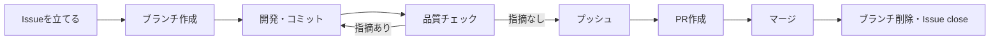

# 開発ガイドライン

> このドキュメントは、このリポジトリで開発を行う際の運用ルールを**人向けに**まとめたものです。
> `main` ブランチは保護されており、直接プッシュはできません（[GitHub側の保護設定](#4-github側の保護設定)を参照）。すべての変更は Issue → ブランチ → Pull Request（以下 PR）の流れで行ってください。
>
> **AI（Claude Code / Cursor）向けの正本は [`.claude/rules/issue-driven-workflow.md`](./.claude/rules/issue-driven-workflow.md)** です。
> 全プロジェクト共通のルールとして配布されており、毎セッション自動で読み込まれます。
> こちらは同じフローを手順とコマンド例つきで説明したものなので、**フローを変えるときは両方を直してください。**

## 目次

1. [開発の流れ](#1-開発の流れ)
2. [ブランチ運用](#2-ブランチ運用)
3. [Pull Requestの作成とマージ](#3-pull-requestの作成とマージ)
4. [GitHub側の保護設定](#4-github側の保護設定)
5. [push前の品質チェック](#5-push前の品質チェック)
6. [CI（自動チェック）](#6-ci自動チェック)

---

## 1. 開発の流れ

開発は必ず次の順序で進めます。

1. **Issueを立てる** — 開発に着手する前に、必ず Issue を作成します（「何を」「なぜ」やるかを明確にするため）
2. **ブランチを作成する** — 作成した Issue の番号を含むブランチを、`main` から切ります
3. **開発してコミットする** — 変更内容が分かるメッセージでコミットします
4. **品質チェックを実行する** — push する前に必ず `bash scripts/quality-check.sh` を実行し、指摘が0件であることを確認します（詳細は[5章](#5-push前の品質チェック)）。指摘があれば修正し、コミットし直してから再度実行します
5. **プッシュする** — 作業ブランチをリモートに push します
6. **PRを作成する** — `main` へ向けて PR を作成し、本文に対応する Issue 番号を記載します
7. **マージする** — PR をマージします（`main` への直接 push はできません）
8. **後片付けする** — マージ後、リモート・ローカル両方の作業ブランチを削除します。Issue は PR のマージに連動して自動的に close されます



---

## 2. ブランチ運用

### 2.1 ブランチ命名規則

```
feature/<issue番号>-<内容を表す短い英語>
```

**Issue番号を必ず含めてください。** ブランチと Issue の対応が一目で分かるようにするためです。

| 例 | 説明 |
| --- | --- |
| `feature/10-github-workflow` | Issue #10「GitHub運用ルールの確立」に対応するブランチ |
| `feature/12-task-read-api` | Issue #12 に対応する、タスク取得APIのブランチ |

> バグ修正など性質が異なる場合は `fix/<issue番号>-<内容>` のように接頭辞を変えても構いません。番号を含める点は変わりません。

### 2.2 `main` ブランチについて

`main` へは直接コミット・pushできません（[GitHub側の保護設定](#4-github側の保護設定)参照）。変更は必ず PR 経由で取り込みます。

---

## 3. Pull Requestの作成とマージ

- PR本文には、対応する Issue 番号を **`Closes #<issue番号>`** の形式で必ず記載してください。マージ時に Issue が自動的に close されます
- レビュー承認は必須にしていません（現状 1人開発のため）。ただし `main` への統合は必ず PR を経由します
- **PRの作成者はマージを実行しません。** 内容を確認した人（リポジトリ管理者）が手動でマージしてください。Claude Codeなどのツールを使ってPRを作成した場合も同様に、マージは行わずユーザーの確認を待ちます
- **マージ方式は「マージコミット」を使ってください。** Squash・Rebaseは使いません（コミット履歴とPR単位の対応を保つため）。GitHub側でもマージコミット以外は選択できないよう設定済みです
- マージ後は、リモートブランチが自動削除されるよう設定済みです
- マージ後、ローカルの作業ブランチも削除してください

```bash
# mainを最新化してブランチを作成
git switch main
git pull
git switch -c feature/<issue番号>-<内容>

# 開発・コミット・プッシュ
git add <ファイル>
git commit -m "<変更内容が分かるメッセージ>"
git push -u origin feature/<issue番号>-<内容>

# PR作成（本文に Closes #<issue番号> を含める）
gh pr create --fill
```

**ここでPRの内容を確認し、問題なければマージします。**

```bash
# マージ（マージコミット方式・リモートブランチも同時に削除）
gh pr merge --merge --delete-branch

# ローカルの後片付け
git switch main
git pull
git branch -d feature/<issue番号>-<内容>
```

---

## 4. GitHub側の保護設定

`main` ブランチには Repository Ruleset により、以下が設定されています。

| ルール | 内容 |
| --- | --- |
| PR必須 | `main` への変更はPR経由のみ可能（直接pushは拒否される） |
| マージ方式はマージコミットのみ | Squash・Rebaseマージは選択不可 |
| force push禁止 | 履歴の書き換えを防止 |
| ブランチ削除禁止 | `main` 自体の削除を防止 |
| マージ後の自動削除 | PRマージ時、リモートの作業ブランチを自動削除 |

管理者を含め、誰も `main` へ直接pushすることはできません。緊急時も、必ずPRを経由してください。

---

## 5. push前の品質チェック

**静的解析（Checkstyle・SpotBugs・oxlint）と既存テストの実行は、push前のこの手順が唯一の検出機会です。** [6章](#6-ci自動チェック)のCIはPRを作成・更新した「後」にしか走らず、ビルドが通ることしか確認しないためです（経緯は6章の冒頭を参照）。

### 実行コマンド

```bash
# backend・frontend両方
bash scripts/quality-check.sh

# 片方だけ確認したい場合
bash scripts/quality-check.sh --backend
bash scripts/quality-check.sh --frontend
```

| 対象 | 内容 |
| --- | --- |
| backend | `./gradlew check`（コンパイル + Checkstyle + SpotBugs + テスト） |
| frontend | `npx oxlint`（Lint）+ `npm run build`（`tsc -b`による型チェック + Viteビルド）+ `npm test`（Vitest） |

いずれもDockerコンテナ内で実行されます（`docker compose up -d`で起動しておく必要があります）。

### 終了コードの意味

| 終了コード | 意味 | 取るべき行動 |
| --- | --- | --- |
| 0 | 全チェック合格 | pushしてよい |
| 1 | 品質上の問題を検出 | 表示された指摘を修正し、コミットし直してから再実行する |
| 3 | 環境の問題で実行できない（コンテナ未起動・git worktree内からの実行など） | 表示された案内に従い、環境を直してから再実行する |

> **frontendのLintは現時点で`--deny-warnings`を付けていません。** `.oxlintrc.json`強化時の品質チェックで検出したsuspicious/jsx-a11y/promiseの指摘（8件、Issue #66・#67で管理）がwarning扱いで残っているため、それらを解消するまでは`scripts/quality-check.sh`内の`OXLINT_ARGS`を空のままにしています。解消後に`--deny-warnings`へ変更し、warningも検出対象にする想定です。

### 品質チェックは2段構え

`git push`を検知したフックが、次の順で実行します。

| 段 | ファイル | 所有 | 中身 |
| --- | --- | --- | --- |
| ① | `scripts/harness-check.sh` | AIハーネス（配布物） | 言語非依存。コンフリクトマーカーの残留・秘匿情報の混入・ブランチ名の規約 |
| ② | `scripts/quality-check.sh` | このプロジェクト | 上表のbackend・frontendのチェック |

①が落ちた時点で②は走りません（安いチェックを先に置いているため）。**①は書き換えないでください。** 冒頭に`generated by tk-media harness`と入っている配布物で、直すと以後の更新が届かなくなります。

### Claude Code・Cursorのどちらでも機械的に強制される

`.claude/settings.json`（PreToolUse）と`.cursor/hooks.json`（beforeShellExecution）が、`git push`を含むコマンドの実行を検知し、上記のチェックを自動実行します。失敗すると**コマンドの実行自体がブロックされます。** 判定ロジックは`guard-core.cjs`の1本で、両ツールでアダプタだけが分かれているため、挙動は揃っています。

同じフックが、**`main`上でのコミット・push**と、**`main`を指すrefspecへのpush**も止めます。

- ブロックされた場合、AIは指摘内容を確認し、指摘が解消するまで「修正 → コミット → 再度push」を自分で繰り返します（安易に作業を止めたり、ユーザーに丸投げしたりしません）
- 誤検知やチェック自体の不具合時のためのエスケープハッチとして、**ユーザーが明示的に許可した場合のみ** `SKIP_QUALITY_CHECK=1 git push ...` を使えます。AIが自己判断でこれを付けることはありません
- **`.claude/settings.json`を変更した場合、Claude Codeの再起動が必要です。** hooksはセッション開始時にのみ読み込まれ、動的な変更を反映しません
- git worktree内では②が動作しません（`docker exec`がメインチェックアウト側のコードを検査してしまう事故を防ぐための意図的な仕様）。メインチェックアウトで作業してください

### 素のgit運用の場合

**ターミナルから直接`git push`する場合は、上記フックが働かず自動ブロックされません。** push前に必ず手動で `bash scripts/harness-check.sh` と `bash scripts/quality-check.sh` を実行してください。なお`main`への直接pushは、この場合もGitHub側のRuleset（[4章](#4-github側の保護設定)）が拒否します。

---

## 6. CI（自動チェック）

`main` へのPRを作成・更新すると、GitHub Actions（[`.github/workflows/ci.yml`](./.github/workflows/ci.yml)）が自動的に以下を検査します。

| job | 内容 |
| --- | --- |
| backend | `./gradlew assemble testClasses`（本体・テストコードのコンパイルと、`bootJar`によるパッケージング） |
| frontend | `npm run build`（`tsc -b`による型チェック + Viteビルド） |

**静的解析（Checkstyle・SpotBugs・oxlint）と既存テストの実行はここでは行いません。** それらは[5章](#5-push前の品質チェック)のpush前チェックが担当します。CIはPRを作成・更新した「後」にしか走らず、品質上の問題に気づくタイミングとして遅いため、主たる品質ゲートとしては据えていません。CIの役割は、開発者のローカル環境固有の事情（Dockerコンテナの状態など）に依存せず、**クリーンな環境でビルドが通ることを最終確認する**二重の網に絞っています。

レビュー承認と同じく必須のステータスチェックには設定していませんが（現状1人開発のため）、マージ前に必ず結果を確認してください。
